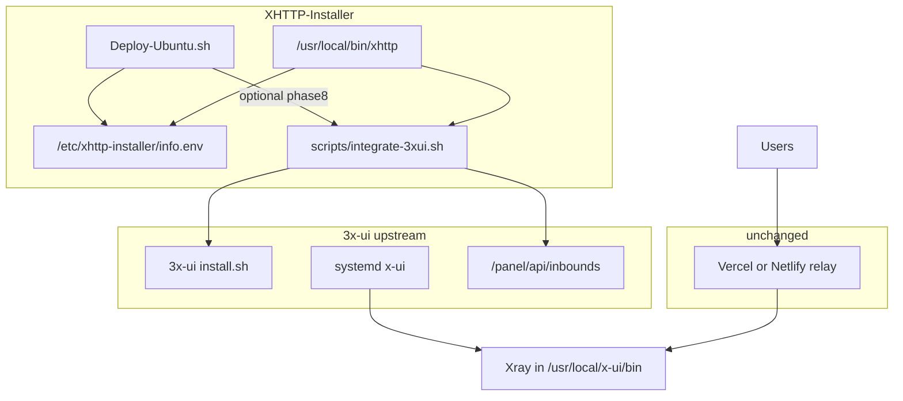

# 3x-ui integration (Level 1 + Level 2)

## Goals

- Keep [Deploy-Ubuntu.sh](Deploy-Ubuntu.sh) as the **CDN + XHTTP deploy** owner; add **optional** 3x-ui for multi-user / traffic limits.
- Do **not** embed 3x-ui source in the repo (GPL attribution stays clean; upstream updates stay independent).
- Preserve the split: **client** Address/SNI/Host = `VERCEL_HOST`; **server** XHTTP `host` = `CFG_DOMAIN` (see [phase4b](Deploy-Ubuntu.sh) lines 1035–1039 and link build at 2677).

## Architecture



## Defaults (user skipped preference questions)

| Decision | Choice |
|----------|--------|
| When to run | **Both**: ask at end of install; skip prompt if `XHTTP_INSTALL_3XUI=yes` |
| Level 2 | **Install + migrate with fallback**: run upstream install when missing; API migrate; on failure emit Level 1 checklist + JSON import template |

---

## Level 1 — Standalone integration script + docs

### New file: [scripts/integrate-3xui.sh](scripts/integrate-3xui.sh)

Executable Bash module invoked from repo root or copied path on server (`/root/XHTTP-Installer/scripts/...`).

**Subcommands:**

| Command | Behavior |
|---------|----------|
| `check` | Require root; load `/etc/xhttp-installer/info.env`; verify relay vars (`VERCEL_HOST`, `CFG_DOMAIN`, paths, certs); print pass/fail |
| `guide` | Print step-by-step checklist (inbound fields, External proxy, disable `xray`, panel security) |
| `install` | Curl official `https://raw.githubusercontent.com/mhsanaei/3x-ui/master/install.sh` (document that panel setup is **interactive**) |
| `preflight` | Backup `config.json` → `/etc/xhttp-installer/xray-config.pre-3xui.json`; check port 443; warn if `xray` active |
| `disable-legacy-xray` | `systemctl stop xray`; `systemctl disable xray` (only after user confirm or `--yes`) |
| `status` | Report `x-ui` / `xray` service state, 443 listener, paths to `3xui.env` if present |

**Outputs written:**

- `/etc/xhttp-installer/3xui-migration.md` — human checklist from `info.env`
- `/etc/xhttp-installer/3xui-inbound.template.json` — Xray-shaped snippet for manual panel import (Level 2 generator can reuse)

**Shared helper:** `scripts/lib/xhttp-state.sh` — `source info.env`, validate required keys, build `ENCODED_EXTRA` same logic as [phase7](Deploy-Ubuntu.sh) (Vercel vs Netlify padding).

### Documentation

- New section in [README_EN.md](README_EN.md) and [README.md](README.md): “User management (3x-ui)”
- Link to upstream [3x-ui API wiki](https://github.com/MHSanaei/3x-ui/wiki/Configuration#api)
- Explicit warnings: Vercel quotas, ToS, one process on 443, CDN host vs server host

---

## Level 2 — Installer hook + API migration

### New file: [scripts/3xui-api-migrate.sh](scripts/3xui-api-migrate.sh)

Called by `integrate-3xui.sh migrate` and optionally by installer phase8.

**Flow:**

1. `check` + `preflight` + backup
2. If `x-ui` not installed → run `install` subcommand (interactive; print credentials reminder to save into `3xui.env`)
3. Read credentials from `/etc/xhttp-installer/3xui.env` (created on first successful login):
   - `THREEXUI_URL` (e.g. `http://127.0.0.1:2053`)
   - `THREEXUI_USER` / `THREEXUI_PASS` or session cookie file
   - `THREEXUI_WEB_BASE_PATH` (from install output)
4. `POST /login` → store session cookie (`3x-ui=...`)
5. `GET /panel/api/inbounds/list` — if matching inbound exists (port + protocol + path), **update**; else `POST /panel/api/inbounds/add`
6. Build inbound payload from `info.env`:
   - VLESS, port `CFG_INBOUND_PORT`, network `xhttp`, TLS cert paths `SSL_CERT`/`SSL_KEY`
   - `xhttpSettings`: `path=CFG_RELAY_PATH`, `host=CFG_DOMAIN`, `mode=auto`, padding from `XPADDING*` / Netlify block
   - `streamSettings.externalProxy` (or panel `subHost` fields per 3x-ui version): `dest=VERCEL_HOST`, `port=443`
   - Seed first client: `INBOUND_UUID` + email `xhttp-migrated`
7. `disable-legacy-xray`
8. `POST /panel/api/server/restartXrayService`
9. Smoke: `curl -sk` CDN path; optional compare generated link host to `VERCEL_HOST`

**Fallback (API or JSON mismatch):**

- Do **not** leave system broken: only disable `xray` if migrate returns success
- On failure: print `guide`, write `3xui-inbound.template.json`, suggest panel **Import** (`POST /panel/api/inbounds/import`) or manual inbound creation
- Log to `/var/log/xhttp-3xui-migrate.log`

**Version note:** Pin/test against current 3x-ui `main` API; add comment in script that XHTTP inbound + subscription had edge-case bugs—recommend per-client QR if sub URL fails.

### Changes to [Deploy-Ubuntu.sh](Deploy-Ubuntu.sh)

**New function:** `phase8_integrate_3xui()` (~80 lines)

- After [phase6_summary](Deploy-Ubuntu.sh) (line 3049), so `info.env` and E2E fields exist
- Trigger if `XHTTP_INSTALL_3XUI=yes` or interactive `confirm "Install 3x-ui user management?"`
- Invoke `"${SCRIPT_DIR}/scripts/integrate-3xui.sh" migrate` (define `SCRIPT_DIR` at top of Deploy-Ubuntu.sh from `BASH_SOURCE`)
- Non-fatal: warn on failure, do not fail entire install

**Reorder in `main`:**

```bash
phase7_install_panel
phase6_summary
phase8_integrate_3xui   # new, optional
```

### Extend embedded `xhttp` panel ([phase7_install_panel](Deploy-Ubuntu.sh) ~2902–2928)

Add menu items (only if `integrate-3xui.sh` exists on server):

- `8) 3x-ui: show migration guide`
- `9) 3x-ui: run integration / migrate`
- `10) 3x-ui: open panel URL` (read `3xui.env`)

Update **Restart** path: if `x-ui` active, suggest `x-ui restart` or `systemctl restart x-ui`; if legacy mode, keep `systemctl restart xray`.

**Uninstall** (`_uninstall`): note that `x-ui uninstall` is separate; do not remove 3x-ui automatically unless user confirms.

### Persist 3x-ui credentials

Append to phase8 or migrate script — write `/etc/xhttp-installer/3xui.env` (mode 600):

```bash
THREEXUI_URL=...
THREEXUI_WEB_BASE_PATH=...
# credentials only if user opts in during migrate
```

Extend [info.env](Deploy-Ubuntu.sh) template optionally:

```bash
THREEXUI_ENABLED="yes|no"
THREEXUI_MIGRATE_STATUS="ok|manual|skipped"
```

---

## Critical invariants (enforced in code comments + migration builder)

| Field | Value source |
|-------|----------------|
| XHTTP `host` | `CFG_DOMAIN` |
| Client / sub host | `VERCEL_HOST` |
| Path | `CFG_RELAY_PATH` / `CFG_PUBLIC_PATH` |
| TLS files | `SSL_CERT`, `SSL_KEY` |
| Netlify `extra` | `XPADDING_KEY`, `XPADDING_HEADER`, `SC_MAX_POST_BYTES` |

Vercel `TARGET_DOMAIN` env vars are **not** modified by 3x-ui integration.

---

## Testing plan (manual on Ubuntu VPS)

1. Fresh XHTTP install (Vercel + Netlify smoke separately if possible)
2. Run `scripts/integrate-3xui.sh guide` — output matches `info.env`
3. Run `migrate` on test VPS with 3x-ui pre-installed vs full `install+migrate`
4. Confirm: only `x-ui` owns 443; old `vless://` with same UUID still works; new client with 10GB limit in panel works
5. Run `xhttp` menu new entries
6. Regression: install with `XHTTP_INSTALL_3XUI` unset → no phase8; relay unchanged

---

## Out of scope (future Level 3)

- Vendoring 3x-ui Go/UI into repo
- Telegram bot / subscription on custom domain
- Non-interactive 3x-ui install without upstream support
- Auto-fixing Vercel usage limits

---

## File summary

| File | Action |
|------|--------|
| [scripts/lib/xhttp-state.sh](scripts/lib/xhttp-state.sh) | **Create** — load/validate `info.env`, build extra JSON |
| [scripts/integrate-3xui.sh](scripts/integrate-3xui.sh) | **Create** — Level 1 CLI |
| [scripts/3xui-api-migrate.sh](scripts/3xui-api-migrate.sh) | **Create** — Level 2 API + fallback |
| [Deploy-Ubuntu.sh](Deploy-Ubuntu.sh) | **Edit** — `SCRIPT_DIR`, `phase8`, `main` order, `xhttp` menu |
| [README_EN.md](README_EN.md), [README.md](README.md) | **Edit** — integration docs |
| [.gitignore](.gitignore) | Optional: ignore local test `3xui.env` samples |

## Implementation order

1. `xhttp-state.sh` + inbound template generator
2. `integrate-3xui.sh` (Level 1 all subcommands)
3. README Level 1 docs
4. `3xui-api-migrate.sh` + `migrate` wiring
5. `phase8` + `xhttp` menu + `info.env` fields
6. Manual test notes in README
