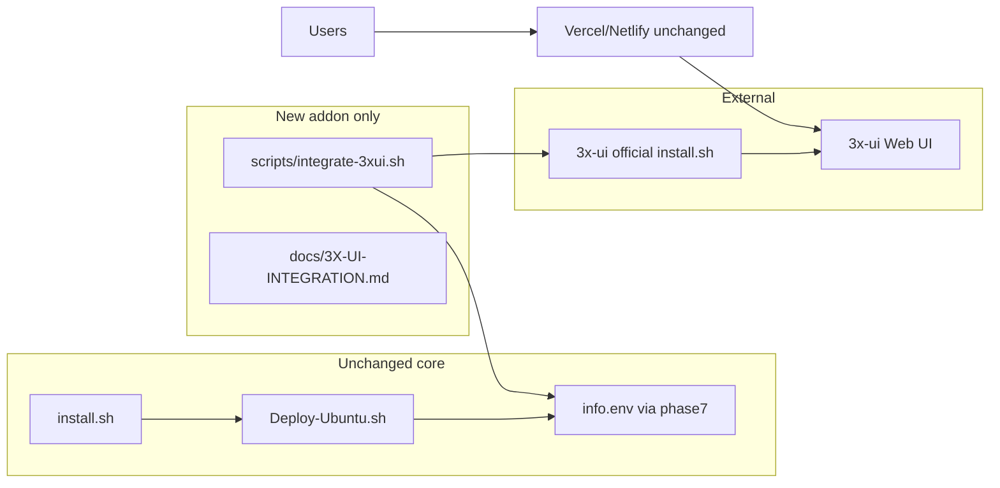

# Level 1: Standalone 3x-ui integration (no core installer changes)

## Constraint (your requirement)

**Do not modify** [Deploy-Ubuntu.sh](Deploy-Ubuntu.sh), [install.sh](install.sh), relay code, or the embedded `xhttp` panel. The main installer app stays exactly as it is today.

Integration is a **separate optional package** in the same repo: run only when you want 3x-ui user management.



---

## Operator workflow (after XHTTP install)

1. Complete normal install (`install.sh` → `Deploy-Ubuntu.sh`) — unchanged.
2. Confirm `/etc/xhttp-installer/info.env` exists (written by existing `phase7_install_panel`).
3. From the cloned repo on the server:

```bash
cd /root/XHTTP-Installer   # or your clone path
sudo bash scripts/integrate-3xui.sh
```

4. Follow printed checklist + [docs/3X-UI-INTEGRATION.md](docs/3X-UI-INTEGRATION.md) to configure 3x-ui inbound and users (10 GB limits, etc.).

Optional one-liner (documented only; no new bootstrap in `install.sh`):

```bash
sudo bash /root/XHTTP-Installer/scripts/integrate-3xui.sh --install
```

---

## Deliverables (new files only)

### 1. [scripts/integrate-3xui.sh](scripts/integrate-3xui.sh)

Root-only Bash script, `set -euo pipefail`, self-contained helpers (`info`/`ok`/`warn`/`fail` — no sourcing `Deploy-Ubuntu.sh`).

**Preconditions**

- `/etc/xhttp-installer/info.env` exists
- `systemctl` available

**CLI flags**

| Flag | Behavior |
|------|----------|
| *(default)* | Backup + generate checklist + interactive confirmations |
| `--install` | Also run upstream `bash <(curl -Ls https://raw.githubusercontent.com/mhsanaei/3x-ui/master/install.sh)` (interactive; user completes panel port/credentials) |
| `--finalize` | Backup + `stop`/`disable` `xray` only (for users who already installed 3x-ui manually) |
| `--install-bin` | Copy script to `/usr/local/bin/xhttp-3xui` for convenience (optional; not done by core installer) |
| `--help` | Usage |

**Core steps**

1. **Source** `info.env` — variables already defined by installer: `CFG_DOMAIN`, `CFG_INBOUND_PORT`, `CFG_RELAY_PATH`, `CFG_PUBLIC_PATH`, `VERCEL_HOST`, `SSL_CERT`, `SSL_KEY`, `XPADDING*`, `SC_MAX_POST_BYTES`, `CFG_PLATFORM`, `INBOUND_UUID`, `CLIENT_LINK`.
2. **Backup** if present: `/usr/local/etc/xray/config.json` → `/etc/xhttp-installer/xray-config.before-3xui.$(date +%Y%m%d%H%M%S).json`.
3. **Generate checklist** — print to terminal and write `/etc/xhttp-installer/3xui-checklist.txt` (mode `600`) with:
   - **Server inbound (3x-ui):** VLESS, XHTTP, TLS, port, cert paths from `SSL_CERT`/`SSL_KEY`, path=`CFG_RELAY_PATH`, XHTTP **host=` `CFG_DOMAIN`, mode=auto, padding (Vercel `100-1000` vs Netlify obfs block aligned with [phase4b_configure_xray](Deploy-Ubuntu.sh) L975–997).
   - **Client / external proxy:** Address, SNI, Request Host = `VERCEL_HOST`; path = `CFG_PUBLIC_PATH`; paste `CLIENT_LINK` as reference; note **External proxy** / subscription `subHost` in panel.
   - **First client:** optional reuse of `INBOUND_UUID`.
   - **Warnings:** panel port must not be 443; do not change Vercel `TARGET_DOMAIN`; create inbound before `--finalize`.
4. **`--install`:** Run official 3x-ui installer; remind GPL attribution and panel SSL choices (reuse cert paths or HTTP + SSH tunnel).
5. **Finalize (interactive confirm):** `systemctl stop xray` && `systemctl disable xray`; check `ss -tlnp` for `CFG_INBOUND_PORT`; remind to finish inbound in 3x-ui before testing clients.
6. **State file** `/etc/xhttp-installer/3xui.env` (mode `600`): `INTEGRATED_DATE`, `CHECKLIST_FILE`, `XRAY_BACKUP`, `THREE_XUI_INSTALLED=true|false`.

**Explicit non-goals (Level 1)**

- No edits to [Deploy-Ubuntu.sh](Deploy-Ubuntu.sh) or generated `config.json`
- No 3x-ui API calls, no DB edits under `/usr/local/x-ui`
- No vendored 3x-ui source in repo

**Rollback helper** (print + doc): stop `x-ui`, restore backup config, `systemctl enable --now xray`.

---

### 2. [docs/3X-UI-INTEGRATION.md](docs/3X-UI-INTEGRATION.md)

Single source of truth for operators (English; can add brief Persian summary at top if desired later).

Sections:

- Prerequisites (successful XHTTP install, `info.env`)
- Quick start (`integrate-3xui.sh` flags)
- Inbound field table (mapping from `info.env` — mirrors installer link builder at [phase7_install_panel](Deploy-Ubuntu.sh) L2670–2677)
- Per-user setup in 3x-ui (10 GB, expiry, subscription caveats for XHTTP)
- Panel security (non-443 port, bind 127.0.0.1 / firewall)
- Rollback procedure
- Troubleshooting (443 conflict, wrong SNI/host, Netlify `extra` mismatch)

---

### 3. Documentation discovery (minimal touch)

**Default:** no README edits — operators find integration via `docs/3X-UI-INTEGRATION.md` and `scripts/integrate-3xui.sh --help`.

**Optional (one line each):** add under a new “Optional: 3x-ui user management” subsection in [README_EN.md](README_EN.md) / [README.md](README.md) linking to the doc only. Skip if you want zero markdown changes outside `docs/`.

---

## Key value mapping (checklist generator logic)

Script derives checklist from `info.env` (same semantics as installer):

| `info.env` | 3x-ui / client |
|------------|----------------|
| `CFG_DOMAIN` | XHTTP **host** on server inbound |
| `VERCEL_HOST` | External proxy dest; client Address/SNI/Host |
| `CFG_RELAY_PATH` | Server XHTTP path |
| `CFG_PUBLIC_PATH` | Client path |
| `SSL_CERT` / `SSL_KEY` | TLS file paths |
| `XPADDING*` / `SC_MAX_POST_BYTES` | Netlify inbound + client `extra` |
| `INBOUND_UUID` | Optional first client |
| Vercel/Netlify relay | **Unchanged** — not configured by this script |

---

## What stays unchanged in the core app

| Component | Change |
|-----------|--------|
| [Deploy-Ubuntu.sh](Deploy-Ubuntu.sh) | **None** |
| [install.sh](install.sh) | **None** |
| `xhttp` menu / heredoc | **None** |
| `deploy/vercel`, `deploy/netlify` | **None** |
| `/etc/xhttp-installer/info.env` format | **None** (script only reads it) |

---

## Manual test plan

1. Fresh XHTTP install (Vercel) → `info.env` present.
2. `sudo bash scripts/integrate-3xui.sh` → checklist matches `CLIENT_LINK` / `xhttp` config display.
3. Netlify install → checklist includes obfs keys.
4. `--install` on test VPS → 3x-ui installs; manual inbound per checklist; `--finalize` → `xray` disabled, client works via CDN.
5. Rollback → single-UUID installer path works again.
6. `--install-bin` → `xhttp-3xui` available without re-running core installer.

---

## Risks and mitigations

- **443 conflict:** Finalize only after explicit `y`; checklist says create 3x-ui inbound first.
- **Wrong client host:** Checklist emphasizes `VERCEL_HOST` vs `CFG_DOMAIN`.
- **Broken relay:** Doc warns not to change CDN env or paths.
- **Upstream 3x-ui changes:** Pin to official install URL; no forked code.

---

## Future Level 2 (out of scope)

Optional later: separate `scripts/integrate-3xui-api.sh` or opt-in flag — still **not** modifying [Deploy-Ubuntu.sh](Deploy-Ubuntu.sh) unless you explicitly choose to wire it later.
